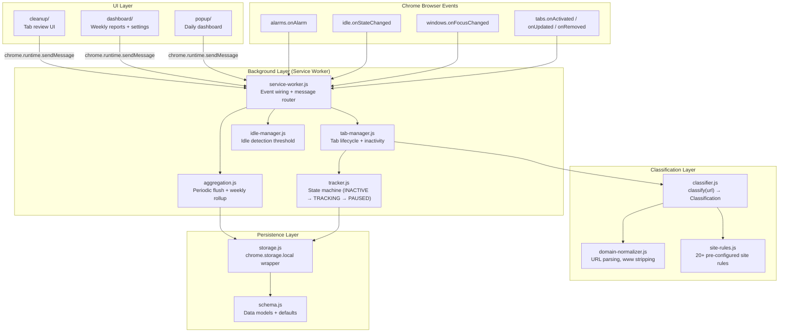

# WebTrack — Web Usage Tracker & Intelligent Tab Cleanup

> **Understand your web time. Clean up your tabs.**

A privacy-first Manifest V3 Chrome extension that tracks your actual active browser usage, intelligently groups related URLs into website categories, and provides daily and weekly reports with tab cleanup suggestions.

## Features

### 📊 Active Time Tracking
- Tracks **actual active browser time** — only when Chrome is focused, the tab is active, and you're not idle
- Event-based tracking using timestamps (no running timers)
- Automatic pause when switching to other apps or going idle

### 🏷️ Smart Website Clustering
- Groups related URLs into website categories (e.g., all LeetCode pages → "LeetCode")
- Pre-configured rules for 20+ popular sites (GitHub, YouTube, Google services, etc.)
- Page-type classification (Problems, Contest, Watch, Search, etc.)
- Unknown sites auto-categorized by domain

### 🧹 Intelligent Tab Cleanup
- Identifies tabs that haven't been used past a configurable threshold
- **Suggests** cleanup — never auto-closes tabs
- Checkbox-based review: close or keep selected tabs
- Learns from your decisions to reduce future noise
- Protected tab support (pinned, audible, whitelisted domains)

### 📈 Daily & Weekly Reports
- **Today**: Active time, top websites with usage bars, site count
- **Weekly**: Total/average time, daily bar chart, top sites with week-over-week % change
- **Insights**: Factual, non-judgmental observations about your usage
- **Tab Hygiene**: Acceptance rate, average open tabs, longest inactive tab

### 🔒 Privacy-First
- **100% local** — no server, no account, no analytics
- Only stores domain/category, not full URLs
- All data stays in `chrome.storage.local`

---

## Getting Started

### First-time installation

> **On first launch, WebTrack shows a welcome screen** inside the popup. Follow the four steps shown there — it takes under a minute.

| Step | What to do |
|------|-----------|
| **1 — Load unpacked** | Open `chrome://extensions`, enable **Developer mode**, click **Load unpacked**, select the `web-usage-tracker` folder |
| **2 — Pin WebTrack** | Click the 🧩 puzzle icon in Chrome's toolbar → click the 📌 pin next to WebTrack |
| **3 — Browse normally** | WebTrack tracks automatically. It pauses when you're idle or switch apps — no configuration needed |
| **4 — Open the popup** | Click the WebTrack toolbar icon to see today's active web time and your top sites |

> **Privacy note:** WebTrack measures active browsing time. It pauses when you're idle or using another app. Your data stays on your device — no server, no account, no analytics.

After clicking **Got it** in the onboarding screen, the welcome overlay won't appear again.  
To reset it, go to **Settings → Clear all data** — the onboarding will appear the next time you open the popup.

---

## Installation (Development)

1. Clone or download this repository
2. Open Chrome and navigate to `chrome://extensions`
3. Enable **Developer mode** (toggle in the top right)
4. Click **Load unpacked**
5. Select the `web-usage-tracker` directory (the one containing `manifest.json`)
6. Pin the extension for easy access


## How to Use

### Tracking starts automatically

Once installed, WebTrack begins tracking in the background. There's nothing to configure — it only counts time when:
- Chrome is **focused** (not behind another app)
- The tab is the **active** tab in the window
- You're **not idle** (mouse/keyboard activity within the idle threshold)

Switching to VS Code, locking your screen, or walking away **automatically pauses** tracking.

### Daily snapshot (popup)

Click the extension icon to see today's usage at a glance:

- **Total active time** for the day
- **Top websites** ranked by time, with usage bars
- **Inactive tab count** — a quick indicator of tabs you may want to close

The popup refreshes live, including time from any in-progress session.

### Tab cleanup

When the popup shows inactive tabs, click **Review inactive tabs** to open the cleanup panel:

1. Tabs that have been inactive past your threshold are listed, longest-inactive first
2. Each tab has a **checkbox** — checked tabs will be closed, unchecked will be kept
3. Click **Close selected** to close the checked tabs, or **Keep selected** to reset their inactivity timers
4. Your close/keep decisions are remembered per domain to reduce future noise

> **Note:** Pinned tabs, tabs playing audio, and whitelisted domains are never suggested for cleanup.

### Weekly report (dashboard)

Click **View weekly report** in the popup (or open the extension's options page) to see:

- **Weekly total** and **daily average** active time
- **Daily bar chart** showing usage across the week
- **Top websites** with week-over-week percentage change (▲/▼)
- **Insights** — factual, non-judgmental observations (e.g., "Thursday was your highest-usage day")
- **Tab hygiene** — acceptance rate, tabs closed via suggestions, longest inactive tab

### Settings

Open the dashboard and scroll to Settings to configure:

| Setting | What it does |
|---------|-------------|
| **Idle threshold** | How long before the system considers you idle and pauses tracking (default: 2 min) |
| **Cleanup threshold** | How long a tab must be inactive before it's suggested for cleanup (default: 10 min) |
| **Ignore pinned tabs** | Never suggest closing pinned tabs |
| **Ignore audible tabs** | Never suggest closing tabs playing audio |
| **Protected domains** | Domains that are never suggested for cleanup (e.g., `gmail.com`) |

### Data & privacy

- All data is stored **locally** in your browser — nothing is sent anywhere
- Open Settings → **Clear all data** to wipe everything and start fresh
- There is no account, no login, and no analytics

## Project Structure

```
web-usage-tracker/
├── manifest.json                  # Manifest V3 config
├── assets/                        # Extension icons
│   ├── icon16.png
│   ├── icon48.png
│   └── icon128.png
├── src/
│   ├── background/                # Service worker + tracking engine
│   │   ├── service-worker.js      # Entry point, event wiring
│   │   ├── tracker.js             # State machine (INACTIVE/TRACKING/PAUSED)
│   │   ├── tab-manager.js         # Tab lifecycle, inactivity tracking
│   │   ├── idle-manager.js        # chrome.idle integration
│   │   └── aggregation.js         # Periodic flush, weekly aggregation
│   ├── clustering/                # URL classification
│   │   ├── domain-normalizer.js   # URL parsing, www stripping
│   │   ├── site-rules.js          # Per-site display names & page types
│   │   └── classifier.js          # Main classify(url) function
│   ├── storage/                   # Persistence layer
│   │   ├── storage.js             # chrome.storage.local wrapper
│   │   └── schema.js              # Data structure definitions
│   ├── cleanup/                   # Tab cleanup engine
│   │   ├── suggestions.js         # Cleanup candidate API
│   │   └── cleanup-ui.js          # Shared review UI rendering
│   ├── popup/                     # Extension popup (daily dashboard)
│   │   ├── index.html
│   │   ├── popup.js
│   │   └── popup.css
│   ├── dashboard/                 # Full dashboard (weekly reports + settings)
│   │   ├── index.html
│   │   ├── dashboard.js
│   │   └── dashboard.css
│   └── utils/                     # Shared utilities
│       ├── time-format.js         # Duration/date formatting
│       └── browser-adapter.js     # Cross-browser compatibility layer
└── README.md
```

## Architecture Overview

The extension follows a **layered, event-driven architecture** built on Manifest V3's service worker model. There are no running timers — all tracking is derived from event timestamps.

### High-Level Data Flow



### Layer Breakdown

#### 1. Background Layer — `src/background/`

The **service worker** is the orchestration hub. It wires Chrome event listeners to handler modules and routes messages from the UI.

| Module | Responsibility |
|--------|---------------|
| `service-worker.js` | Entry point — registers all event listeners, routes `chrome.runtime.onMessage` to handlers |
| `tracker.js` | Singleton state machine with three states: `INACTIVE`, `TRACKING`, `PAUSED`. Uses **event timestamps** (not intervals) to calculate duration. Sessions are "flush-on-end": active time is computed and stored only when a session ends. |
| `tab-manager.js` | Maintains an in-memory `Map<tabId, TabInstance>` of all open tabs. Coordinates with the tracker on activation/deactivation and exposes inactivity data for cleanup. |
| `idle-manager.js` | Wraps `chrome.idle` — configures the idle detection threshold and forwards state changes. |
| `aggregation.js` | Sets up two `chrome.alarms`: a **5-minute periodic flush** (to guard against service worker termination) and an **hourly day-rollover check**. Also provides `aggregateWeekly()` to compute weekly totals from daily records. |

#### 2. Classification Layer — `src/clustering/`

Turns raw URLs into structured website categories:

```
https://leetcode.com/problems/two-sum
        │
        ▼
  domain-normalizer.js    →  { domain: "leetcode.com", hostname: "leetcode.com" }
        │
        ▼
  site-rules.js           →  { name: "LeetCode", pageTypes: { "/problems/*": "Problems" } }
        │
        ▼
  classifier.js           →  { category: "LeetCode", categoryId: "leetcode",
                               pageType: "Problems", icon: "💻" }
```

- **Known sites** (20+) use hand-authored rules with display names, icons, and path-based page type matching.
- **Unknown sites** fall back to the registrable domain as the category name.
- **Google services** can be split by subdomain (e.g., `mail.google.com` → "Gmail").

#### 3. Persistence Layer — `src/storage/`

All persistent data flows through a single `storage.js` wrapper around `chrome.storage.local`:

| Storage Key Pattern | Data |
|---|---|
| `wt_settings` | User settings merged with defaults |
| `wt_daily_YYYY-MM-DD` | Per-day usage record (total seconds, per-website breakdown, tab hygiene counters) |
| `wt_tab_decisions` | Last 500 close/keep decisions for lightweight learning |
| `wt_weekly_stats` | Aggregated tab hygiene metrics |

#### 4. UI Layer — `src/popup/`, `src/dashboard/`, `src/cleanup/`

All UI surfaces communicate with the background via `chrome.runtime.sendMessage`. They are stateless — every render fetches fresh data from the service worker.

| Surface | Entry Point | Purpose |
|---------|------------|---------|
| Popup | `popup/index.html` | Compact daily snapshot: total active time, top sites, inactive tab count |
| Dashboard | `dashboard/index.html` | Full weekly report with daily bar chart, site rankings, week-over-week trends, tab hygiene, and settings |
| Cleanup UI | `cleanup/cleanup-ui.js` | Shared checkbox-based review for closing/keeping inactive tabs |

### Tracking State Machine

```
             ┌────────────┐
             │  INACTIVE   │
             └──────┬──────┘
                    │  tab activated + browser focused + user active
                    ▼
             ┌────────────┐
        ┌───▶│  TRACKING   │◀───┐
        │    └──────┬──────┘    │
        │           │           │
        │    tab switch /       │  user returns /
        │    window blur /      │  window focus /
        │    user idle          │  tab re-activated
        │           │           │
        │           ▼           │
        │    ┌────────────┐     │
        │    │   PAUSED    │────┘
        │    └──────┬──────┘
        │           │  session end (tab closed / URL change)
        │           ▼
        │    flush accumulated seconds → storage
        │           │
        └───────────┘
```

Time is **accumulated on pause** and **computed on end** — no setInterval ticks.

### Message Protocol

The popup and dashboard communicate with the service worker via a request/response protocol:

| Message Type | Direction | Description |
|---|---|---|
| `GET_TODAY_USAGE` | UI → BG | Fetch today's daily record (with live session time merged) |
| `GET_WEEKLY_DATA` | UI → BG | Fetch current + previous week aggregated data |
| `GET_INACTIVE_TABS` | UI → BG | Get tabs exceeding the cleanup threshold |
| `CLOSE_TABS` | UI → BG | Close selected tabs and record decisions |
| `KEEP_TABS` | UI → BG | Reset inactivity timers and record decisions |
| `GET_SETTINGS` / `SAVE_SETTINGS` | UI → BG | Read/write user settings |
| `GET_TRACKER_STATUS` | UI → BG | Get current state machine state + open tab count |
| `GET_TAB_HYGIENE` | UI → BG | Compute weekly tab hygiene metrics |

## Tech Stack

- **Plain JavaScript** (ES modules, no build step)
- **Manifest V3** (Chrome extension platform)
- **CSS** (vanilla, no framework)
- **chrome.storage.local** for persistence
- **chrome.idle**, **chrome.tabs**, **chrome.windows**, **chrome.alarms** APIs

## Settings

| Setting | Default | Description |
|---------|---------|-------------|
| Idle threshold | 2 minutes | Pause tracking after this period of inactivity |
| Cleanup threshold | 10 minutes | Suggest closing tabs inactive for this long |
| Ignore pinned tabs | ✓ | Never suggest closing pinned tabs |
| Ignore audible tabs | ✓ | Never suggest closing tabs playing audio |
| Protected domains | gmail.com, etc. | Never suggest closing these domains |

## Privacy

WebTrack is designed to be **completely local**:

- ❌ No server communication
- ❌ No user accounts
- ❌ No analytics or telemetry
- ❌ No browsing history upload
- ❌ No page content collection
- ✅ All data stored locally in your browser
- ✅ You can clear all data at any time from Settings

## License

MIT
