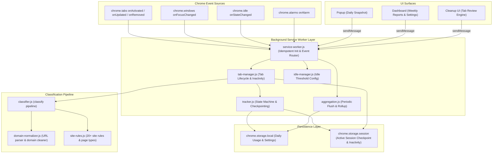
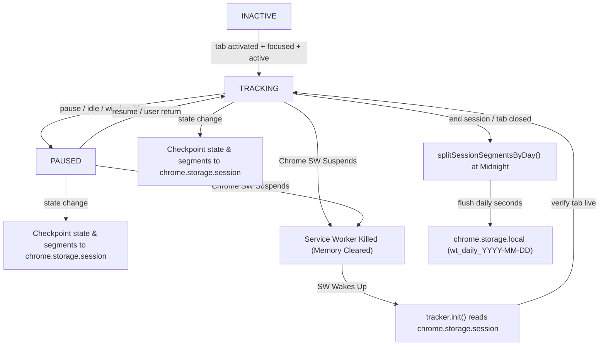

# WebTrack — Web Usage Tracker & Intelligent Tab Cleanup

> **Understand your web time. Clean up your tabs.**

A privacy-first Manifest V3 Chrome extension that tracks your actual active browser usage, intelligently groups related URLs into website categories, and provides daily and weekly reports with tab cleanup suggestions.

---

## Key Architectural Highlights & Improvements

- **Service-Worker Suspension Survival:** Active tracking sessions checkpoint state (`tabId`, `startTime`, `accumulatedSeconds`, `segments`) to `chrome.storage.session` on every state transition (`startSession`, `pause`, `resume`). When Chrome suspends the background service worker, un-flushed tracking state is automatically restored on worker wake-up with zero data loss.
- **Exact Midnight Session Splitting:** Sessions spanning midnight (e.g. 11:45 PM to 00:15 AM) are automatically split across calendar day boundaries so each day receives its precise credited duration.
- **Like-for-Like Partial Week Comparison:** Week-over-week trends compare identical elapsed days of the current week against the same corresponding days of the previous week, eliminating artificial percentage drops during ongoing weeks.
- **Verified Zero-Drift & Zero-Loss:** Includes automated stopwatch drift benchmarks (0.0000% error) and forced service-worker suspension benchmarks (0s data loss).

---

## Features

### 📊 Active Time Tracking
- Tracks **actual active browser time** — only when Chrome is focused, the tab is active, and you're not idle
- Event-based tracking using timestamps (no running timers)
- Automatic pause when switching to other apps or going idle
- Checkpointed state persistence to survive background worker suspension

### 🏷️ Smart Website Clustering
- Groups related URLs into website categories (e.g., all LeetCode pages → "LeetCode")
- Pre-configured rules for 20+ popular sites (GitHub, YouTube, Google services, etc.)
- Page-type classification (Problems, Contest, Watch, Search, etc.)
- Unknown sites auto-categorized by domain

### 🧹 Intelligent Tab Cleanup
- Identifies tabs that haven't been used past a configurable threshold
- **Suggests** cleanup — never auto-closes tabs
- Checkbox-based review: close or keep selected tabs
- Learns from your decisions to reduce future noise
- Protected tab support (pinned, audible, whitelisted domains)

### 📈 Daily & Weekly Reports
- **Today**: Active time, top websites with usage bars, site count
- **Weekly**: Total/average time, daily bar chart, top sites with like-for-like week-over-week % change
- **Insights**: Factual, non-judgmental observations about your usage
- **Tab Hygiene**: Acceptance rate, average open tabs, longest inactive tab

### 🔒 Privacy-First
- **100% local** — no server, no account, no analytics
- Only stores domain/category, not full URLs
- Detailed permission justifications provided in [PRIVACY.md](./PRIVACY.md)

---

## Getting Started

### Installation (Development)

1. Clone or download this repository
2. Open Chrome and navigate to `chrome://extensions`
3. Enable **Developer mode** (toggle in top right)
4. Click **Load unpacked**
5. Select the `web-usage-tracker` directory (containing `manifest.json`)
6. Pin WebTrack for easy access

---

## Automated Tests & Benchmarks

WebTrack includes comprehensive automated tests built on Node.js' native test runner (`node:test`).

### Run Test Suite & Benchmarks

```bash
npm test
```

### Test Coverage

| Test File | Scope |
| :--- | :--- |
| `tests/tracker.test.mjs` | Tracker state machine, state persistence, service-worker suspension recovery |
| `tests/classifier.test.mjs` | Table tests for URL classification, site rules, page types, Google subdomains, edge cases |
| `tests/week-math.test.mjs` | Date math, Monday-based week ranges, midnight session splitting, like-for-like week math |
| `tests/aggregation.test.mjs` | Weekly rollup calculations & daily breakdown aggregation |
| `tests/browser-compat.test.mjs` | Browser API adapter fallbacks |
| `tests/benchmarks.test.mjs` | Stopwatch accuracy benchmark (0.00% drift) & forced suspension recovery benchmark (0s loss) |

### Benchmark Results

```text
--- Stopwatch Benchmark ---
Expected Duration  : 300s
Calculated Duration: 300s
Absolute Error     : 0s
Relative Error     : 0.0000%

--- Forced SW Suspension Benchmark ---
Suspension Timeline  : Session started 120s ago, SW suspended 60s ago, recovered at T=0s
Expected Active Time : 120s
Recovered Active Time: 120s
Un-flushed Time Lost : 0s
```

---

## Architecture Overview

### 1. High-Level System Architecture


```mermaid
graph TD
    subgraph BrowserEvents["Chrome Event Sources"]
        BE_Tabs["chrome.tabs onActivated / onUpdated / onRemoved"]
        BE_Win["chrome.windows onFocusChanged"]
        BE_Idle["chrome.idle onStateChanged"]
        BE_Alarm["chrome.alarms onAlarm"]
    end

    subgraph ServiceWorkerLayer["Background Service Worker Layer"]
        SW["service-worker.js (Idempotent Init & Event Router)"]
        TM["tab-manager.js (Tab Lifecycle & Inactivity)"]
        TR["tracker.js (State Machine & Checkpointing)"]
        IM["idle-manager.js (Idle Threshold Config)"]
        AG["aggregation.js (Periodic Flush & Rollup)"]
    end

    subgraph ClassificationLayer["Classification Pipeline"]
        CL["classifier.js (classify pipeline)"]
        DN["domain-normalizer.js (URL parser & domain cleaner)"]
        SR["site-rules.js (20+ site rules & page types)"]
    end

    subgraph StorageLayer["Persistence Layer"]
        ST_Local["chrome.storage.local (Daily Usage & Settings)"]
        ST_Session["chrome.storage.session (Active Session Checkpoint & Inactivity)"]
    end

    subgraph UILayer["UI Surfaces"]
        POP["Popup (Daily Snapshot)"]
        DASH["Dashboard (Weekly Reports & Settings)"]
        CLEAN["Cleanup UI (Tab Review Engine)"]
    end

    BE_Tabs --> SW
    BE_Win --> SW
    BE_Idle --> SW
    BE_Alarm --> SW

    SW --> TM
    SW --> IM
    SW --> AG

    TM --> TR
    TM --> CL
    CL --> DN
    CL --> SR

    TR --> ST_Session
    TR --> ST_Local
    TM --> ST_Session
    AG --> ST_Local

    POP -- "sendMessage" --> SW
    DASH -- "sendMessage" --> SW
    CLEAN -- "sendMessage" --> SW
```

### 2. Tracking State Machine & Service Worker Suspension Recovery


```mermaid
graph TD
    IN["INACTIVE"] -->|"tab activated + focused + active"| TRK["TRACKING"]
    TRK -->|"pause / idle / window blur"| PSD["PAUSED"]
    PSD -->|"resume / user return"| TRK
    
    TRK -->|"state change"| CP1["Checkpoint state & segments to chrome.storage.session"]
    PSD -->|"state change"| CP2["Checkpoint state & segments to chrome.storage.session"]
    
    TRK -->|"Chrome SW Suspends"| SWS["Service Worker Killed (Memory Cleared)"]
    PSD -->|"Chrome SW Suspends"| SWS
    
    SWS -->|"SW Wakes Up"| INIT["tracker.init() reads chrome.storage.session"]
    INIT -->|"verify tab live"| TRK
    
    TRK -->|"end session / tab closed"| END["splitSessionSegmentsByDay() at Midnight"]
    END -->|"flush daily seconds"| DB["chrome.storage.local (wt_daily_YYYY-MM-DD)"]
```

---

## Permissions Justification

Manifest V3 requires permissions to be explicitly declared. WebTrack requests only necessary permissions:

| Permission | Reason |
| :--- | :--- |
| `tabs` | Required to read active tab domain/category for tracking and track tab inactivity timestamps for cleanup suggestions. Data stays 100% local. |
| `storage` | Required to persist settings, daily summaries (`chrome.storage.local`), and active session checkpoints (`chrome.storage.session`). |
| `idle` | Required to detect system idle state and pause tracking automatically when away from keyboard/mouse. |
| `alarms` | Required to schedule periodic data flushes (every 5 minutes) and hourly maintenance. |

For detailed security information, see [PRIVACY.md](./PRIVACY.md).

---

## Project Structure

```
web-usage-tracker/
├── manifest.json                  # Manifest V3 config (Chrome target)
├── package.json                   # NPM package definition & test script
├── PRIVACY.md                     # Privacy Policy & permission justifications
├── .github/workflows/test.yml     # Automated CI test runner workflow
├── assets/                        # Extension icons
├── src/
│   ├── background/                # Service worker + tracking engine
│   │   ├── service-worker.js      # Entry point, idempotent init
│   │   ├── tracker.js             # State machine + session checkpointing + midnight split
│   │   ├── tab-manager.js         # Tab lifecycle & inactivity tracking
│   │   ├── idle-manager.js        # chrome.idle integration
│   │   └── aggregation.js         # Periodic flush & hourly maintenance
│   ├── clustering/                # URL classification
│   │   ├── domain-normalizer.js   # URL parsing & domain normalizer
│   │   ├── site-rules.js          # Per-site display names & page types
│   │   └── classifier.js          # Main classify(url) pipeline
│   ├── storage/                   # Persistence layer
│   │   ├── storage.js             # chrome.storage.local & session wrapper
│   │   └── schema.js              # Data models & defaults
│   ├── cleanup/                   # Tab cleanup engine
│   │   ├── suggestions.js         # Candidate calculation
│   │   └── cleanup-ui.js          # Shared review UI rendering
│   ├── popup/                     # Daily snapshot popup
│   └── dashboard/                 # Weekly reports & settings
└── tests/                         # Native node:test suite & benchmarks
    ├── mock-chrome.mjs            # Chrome API mock environment
    ├── tracker.test.mjs           # State machine & suspension recovery tests
    ├── classifier.test.mjs        # Classifier table tests
    ├── week-math.test.mjs         # Midnight split & like-for-like week math tests
    ├── aggregation.test.mjs       # Weekly rollup tests
    ├── browser-compat.test.mjs    # Compatibility shim tests
    └── benchmarks.test.mjs        # Stopwatch & forced suspension benchmarks
```

---

## License

MIT
